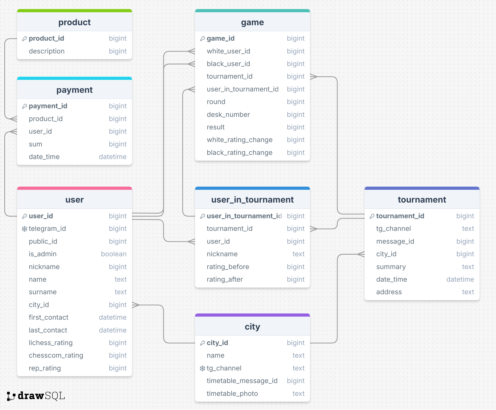

# Телеграм бот Rep Chess клуба

## Описание

Телеграм бот @RepChessBot шахматного клуба Rep Chess для анонса и проведения турниров, продажи мерча и видеокурсов, а также для подсчета rep-рейтинга.

## Схема базы данных

## Хранение данных

Вся информация о пользователях/турнирах/видеокурсах/мерче хранится в базе данных.
Также для быстрого доступа к информации она кэшируется:
- Информация о пользователе хранится в `context.user_data["user_db_data"]`, это копия данных из таблицы user.
- Информация о активном турнире и лагере хранится в `start.py`. Возможно, их стоит перенести в `context.bot_data`, но непонятно, как их инициализировать при обновлении бота.

## Особенности реализации

Также в `context.user_data["text_message"]` хранится функция для обработки введенного юзером сообщения То есть сначала идёт запрос юзеру "Введи что-нибудь", и в `text_message` сохраняется функция для обработки этого сообщения. Так сделано, чтобы если юзер случайно нажал, например, на "Ввести имя", он имел возможность ничего не вводить, а просто нажать на любую кнопку, которая была выше. Это поле сбрасывается в `None` при любом нажатии на кнопки меню внизу. Если юзер что-то написал, а в `text_message` хранится `None`, то сообщение просто игнорируется.

То же самое с `context.user_data["forwarded_message"]`. Тут хранится функция для обработки пересылаемого сообщения. Нужно только для админа.

## Структура директорий

В `/src` хранится весь рабочий код на Python. В каждой директории хранятся обработчики отдельных кнопок меню.
